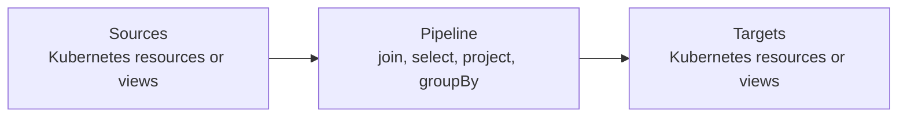

# Δ-controller Overview

Δ-controller is the Kubernetes application layer of this repository. It takes the generic DBSP
machinery described in the main concepts guides and packages them up as Kubernetes controllers that
can react to object deltas instead of rebuilding state from scratch on every event. Note that you
can also write Kubernetes controllers via DBSP's JavaScript runtime. Δ-controller however exposes
controllers as a custom Kubernetes resource and manages the lifecycle, which makes it possible to
dynamically inject new controllers by a simple `kubectl apply`.

The main unit of deployment is an `Operator` custom resource. An operator contains one or more
controllers. Each controller watches one or more sources, runs a declarative pipeline, and writes
the result to one or more targets. Sources and targets can be regular Kubernetes resources, or
they can be local views that exist only inside Δ-controller.

This matters in the larger DBSP context because the controller logic is still just an incremental
dataflow. The same runtime can connect Kubernetes watches to DBSP circuits, but it can also join
those flows with other producers and consumers from the workspace. In practice that means a
pipeline may start from Kubernetes objects, pass through views, and end in native Kubernetes
resources, or it may feed another runtime consumer implemented in Go.

The main benefit is correctness by construction. A declarative controller describes the snapshot
shape of the computation, and Δ-controller compiles it into an *incremental* form that processes
changes. This avoids much of the usual operator boilerplate around watch management, object joins,
caching, and diff handling. In addition, Δ-controller also applies a so-called *reconciler* pass
after incrementalization, which makes sure noise (e.g., an adversary rewriting the controller
target object in the API server) is canceled out by the controller. Both transformation passes can
be disabled in a per-controller basis using `spec.controllers[].options`.

There are also deliberate tradeoffs. Δ-controller operates on unstructured objects, so there is no
compile-time schema safety. Views are in-memory only, so they disappear on restart and get rebuilt
from source watches. The framework is strongest when most of the work is data reshaping, joining,
filtering, and aggregation. If the last step must call an imperative API, Δ-controller can still be
used for the data preparation stage and hand the result to custom Go code.
