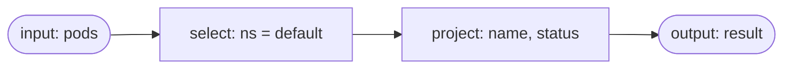
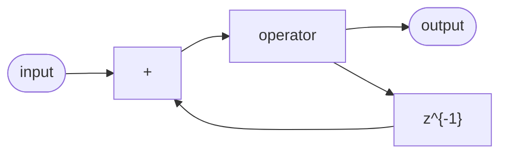

# Basics: Data models, Z-sets, circuits, operators

## Documents

DBSP processes collections of documents. A document is any structured data object with named
fields, like a JSON object or a database row.

The engine supports two document models. Unstructured documents are free-form JSON, like what you
get from the Kubernetes API or a MongoDB document database. Fields are accessed by path
(`$.metadata.name`, `$.spec.containers[0].image`). Relational rows are schema-bound tuples with
typed columns and primary keys, used when working with the SQL compiler.

Both models work identically inside the engine. The SQL compiler produces rows; the aggregation
compiler and the Kubernetes connector produce JSON documents. You rarely need to think about the
difference.

## Z-sets

Recall, a Z-set is the universal data type in DBSP: every input, every output, and every
intermediate result flowing through a circuit is a Z-set. Think of as a collection where each
element carries an integer weight: a weight of +1 means the element is present, and a weight of -1
means it has been removed. An update is both: -1 for the old version, +1 for the new. Elements
whose weight reaches zero disappear from the collection. Z-set example:

```
{ alice -> +1 }     alice is present
{ bob   -> +1 }     bob is present
{ carol -> -1 }     carol was deleted
```

This is the key insight that makes incremental computation possible. Instead of shipping entire
collections around, DBSP works with changes: small Z-sets that describe what was added, removed, or
modified. The engine never needs to see the full dataset; it reasons purely in terms of these
deltas.

The below examples use the DBSP JavaScript runtime, a lightweight environment for prototyping and
testing DBSP circuits. In the JS runtime, Z-set entries are `[document, weight]` pairs:

```js
publish("users", [
  [{ id: 1, name: "alice" },  1],   // insert alice
  [{ id: 2, name: "bob"   },  1],   // insert bob
]);
```

A subsequent change removing alice and updating bob's name looks like:

```js
publish("users", [
  [{ id: 1, name: "alice" },         -1],  // delete alice
  [{ id: 2, name: "bob" },           -1],  // delete old bob
  [{ id: 2, name: "bob-updated" },    1],  // insert new bob
]);
```

Z-sets support pointwise addition (merge two Z-sets by summing weights per element), negation (flip
all signs), and subtraction. These algebraic properties are what allow DBSP to mechanically
transform any computation into an incremental one.

## Circuits

A circuit is a dataflow graph. Data enters through input nodes, flows through a chain of operators,
and leaves through output nodes. Each edge carries Z-sets.

The following circuit processes schemaless `pod` documents by selecting only the ones in namespace
`default` and returning `(name, status)` pairs on the `result` output.



Circuits are first-class, so this one can be laid out by hand, node by node:

```js
const c = circuit.create("pods-in-default");
const pods = c.input("pods");
const sel = c.node('@select:{"@eq":["$.metadata.namespace","default"]}');
const proj = c.node('@project:{"name":"$.metadata.name","status":"$.status"}');
const result = c.output("result");
c.edge(pods, sel, 0);
c.edge(sel, proj, 0);
c.edge(proj, result, 0);
```

Every node is one operator named by a spec, and `.node()` returns the node id to wire with.
`.input()` and `.output()` add the boundary nodes and bind them to their topics, and `.edge()`
connects a node to an input port of the next one: the script is the diagram above, written out.

You normally do not build circuits by hand, though. Instead, you write a query (SQL or an
aggregation pipeline) and a compiler turns it into a circuit for you. The below aggregation pipeline
is more or less equivalent with the above circuit.

```js
const c = aggregate.compile([
  { "@select": { "@eq": ["$.metadata.namespace", "default"] } },
  { "@project": { name: "$.metadata.name", status: "$.status" } }
], { inputs: "pods", output: "result" });
```

Both ways return the same kind of handle around the circuit, and everything below applies to either.
By default, circuits perform snapshot computation. To process changes, they need to be explicitly
transformed with `Incrementalizer`, and `.commit()` installs the result into the runtime: building
or compiling a circuit is one thing, committing is what starts it.

```js
c.transform({ name: "Incrementalizer" }).commit();
```

At this point the circuit is ready to process deltas: it subscribes to the `pods` topic, processes
every incoming change as a Z-set, and publishes results to the `result` topic (again as a Z-set).

### Recursion

Circuits must be acyclic so the engine can evaluate nodes in the right order. For recursive
computations (like computing transitive closures), DBSP provides a delay operator (`z^{-1}`) that
outputs the value it received in the previous evaluation step. This breaks the cycle in the graph
while preserving the feedback semantics.



Most users will not need to work with feedback loops directly; they are used internally by the
engine for recursive query support.

## Operators

Operators are the building blocks inside circuits. Each one takes one or more Z-sets as input and
produces a Z-set as output.

### Filters and projections

**Select** filters elements by a predicate. Elements that match pass through unchanged; the rest
are dropped. The following keeps only pods labeled as `app: nginx`.

```js
{ "@select": { "@eq": ["$.metadata.labels.app", "nginx"] } }
```

**Project** reshapes each element by evaluating an expression. The output contains transformed
documents. The following extracts the name and container count.

```js
{ "@project": {
    name: "$.metadata.name",
    containers: { "@len": ["$.spec.containers"] }
}}
```

Both are incremental by nature: applying a filter or projection to a delta produces the correct
output delta, with no extra state needed.

### Joins

The Cartesian product operator combines elements from two inputs. In practice it is always paired
with a filter (the join condition) and a projection (the output columns). The SQL compiler
generates this pattern automatically from JOIN clauses:

```js
const c = sql.compile(
  "SELECT u.name, o.total FROM users u JOIN orders o ON u.id = o.user_id",
  { output: "joined" }
);
```

When incrementalized, joins maintain a memory of what they have seen from each side, so that when a
new row arrives on one input, it can be correctly matched against the accumulated rows from the
other input.

### Distinct and grouping

**Distinct** converts a weighted Z-set into set semantics: every element with a positive
accumulated weight becomes weight 1; everything else is removed. This is useful when you care about
presence, not multiplicity.

**GroupBy** aggregates documents by a key, producing one output element per group with a running
accumulator (count, sum, etc.).

Both operators need to track accumulated state internally. The engine handles this automatically
during incrementalization by wrapping them in the appropriate bookkeeping.

### Structural operators

**Unwind** flattens a list field. For each element in the list, a separate output document is
produced, with the list field replaced by that one element. The following generates one document
per container in the pod, each carrying a single container object under `spec.containers`.

```js
{ "@unwind": "$.spec.containers" }
```

Unwind is a pure flatten: it renames nothing and injects no bookkeeping, so an unwound row does not
record which element it came from. Positions and identity are lost in the process: Z-sets are
unordered, and output documents that come out identical merge into one entry with their weights
added. Whatever the downstream stages need must be captured before flattening. **Enumerate** is the
tool for that, pairing every list element with its position:

```js
[
  { "@project": { containers: { "@enumerate": ["$.spec.containers"] } } },
  { "@unwind": "$.containers" }
]
```

Every output document now carries `containers.index` and `containers.value`. The index both keeps
duplicate elements distinct and lets a later stage rebuild the list in its original order.

### Primitive operators

These manage circuit plumbing rather than data transformation. **Integrate** computes the running
sum of all inputs seen so far, that is, it converts a stream of deltas into a
snapshot. **Differentiate** does the inverse: it extracts the delta from consecutive
snapshots. **Delay** outputs the previous step's value. **Input** and **Output** mark the circuit
boundary. You will see these in circuit dumps and observer output, but you usually do not create
them directly.
