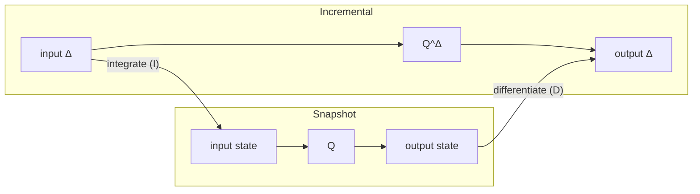

# Overview: Snapshot computation vs incremental computation

DBSP turns snapshot computations into incremental ones. This section introduces the core abstractions DBSP uses: streams, Z-sets, and operators, and shows how conversion from snapshot to incremental execution works.

## Two execution models

Every data pipeline can be thought of in two ways. In the snapshot model
the pipeline receives the complete current input and produces the complete
current output. In the incremental model the pipeline receives the change
to the input and produces the change to the output.

The following diagram shows the relationship. On the left, the snapshot
pipeline `Q` maps full state to full state. On the right, the incremental
pipeline `Q^Δ` maps deltas to deltas. The two are connected by integration
(accumulating deltas into state) and differentiation (computing the
difference between consecutive states).



The snapshot model is the specification: it defines correct output for any
input. The incremental model is an optimization: it produces the same
accumulated output over time, but does less work per step. DBSP's
contribution is a mechanical procedure for deriving the right-hand side
from the left-hand side, together with a proof that they agree.


## Streams

DBSP models time as a sequence of discrete steps, not wall-clock time, but
logical steps such as transactions or watch events. A stream is simply an
infinite sequence of values, one per step:

```
s[0], s[1], s[2], ...
```

There are two natural views of the same evolving dataset. The snapshot
stream `s` gives the full state at each step. The delta stream `Δs` gives
the change at each step, defined as the difference between consecutive
snapshots: `Δs[t] = s[t] − s[t−1]`.

Two operators convert between these views. Integration (`I`) computes the
running sum of a delta stream, recovering the snapshot stream.
Differentiation (`D`) computes the consecutive difference of a snapshot
stream, recovering the delta stream. These two operators are inverses of
each other: integrating then differentiating (or the other way around)
gives back the original stream.

This is the entire temporal model. There is no windowing, no watermarking,
no out-of-order handling at this level. Time is just an index, and every
stream value is a self-contained Z-set.


## Z-sets

A Z-set is the data structure that lives on every wire in a DBSP circuit.
It is a map from elements (rows, objects, records, whatever your domain
is) to integer weights.

A weight of +1 means the element is present. A weight of −1 means the
element has been removed. A weight of 0 means the element is absent (and
is not stored). Higher positive weights encode duplicates in a multiset.

What makes Z-sets powerful is that they form an abelian group under
pointwise addition. Adding two Z-sets sums their weights element by
element. Negating a Z-set flips all signs. The zero Z-set is the empty
map. This group structure is what lets DBSP define subtraction (for
differentiation), addition (for integration), and change propagation (for
incrementalization) using a single uniform algebra.

An insertion is a Z-set with one element at weight +1. A deletion is weight
−1. An update is the sum of a deletion of the old value and an insertion of
the new value. A transaction is a Z-set containing all the insertions and
deletions in that transaction. There is no special "update" operation and
no special "delete" operation, everything is just addition of Z-sets.


## Operators and linearity

An operator is a function from one or more Z-sets to a Z-set. DBSP
classifies operators by how they interact with addition, because this
classification determines how they can be incrementalized.

A linear operator satisfies `O(a + b) = O(a) + O(b)`. If you split the input into two parts, apply
the operator to each part, and add the results, you get the same answer as applying the operator to
the combined input. Selection and projection are linear: filtering the change gives you the change
in the filtered output and likewise, projecting a change equals the change in the projected output.

A bilinear operator is linear in each argument separately. Cartesian
product (and therefore join, which is Cartesian product followed by a
filter) is bilinear. If only the left input changes, the output change
depends on the left change crossed with the full right input. If only the
right input changes, it is the reverse. If both change, there is an
additional cross-term between the two changes. This is the source of the
"three-term expansion" that makes incremental joins work correctly.

A non-linear operator is everything else. Distinct (set semantics) and group-by aggregation are
non-linear, because their output depends on the global distribution of weights, not just the
change. For these operators, DBSP falls back to maintaining the full state internally and emitting
only the change in the output. Note that certain aggregations can still be optimized and DBSP does
its best to make typical aggregations (e.g., group-by) much more efficient than the snapshot
version.

## The incrementalization recipe

The snapshot model defines what the correct output is. The incremental model computes it
efficiently. DBSP provides the bridge: a mechanical algorithm that converts any snapshot circuit
into an incremental circuit with a formal proof of equivalence. The conversion depends on three
ideas, Z-sets as the uniform data representation, streams as the temporal model, and operator
linearity as the guide for rewriting, and produces a circuit where each step does work proportional
to the input change rather than the total state.  The conversion is purely structural: it walks the
circuit and rewrites each operator according to its linearity class.

For a linear operator, the incremental version is the operator itself. If
the operator distributes over addition, then applying it to a change
directly gives the change in the output. No state, no bookkeeping.

For a bilinear operator (like join), the incremental version maintains an
integrated copy of each input and computes three terms per step: the left
change crossed with the accumulated right, the accumulated left crossed
with the right change, and the left change crossed with the right change.
The three terms are added to produce the output change. This is where the
per-side accumulators in an incremental join come from, they are not an ad
hoc implementation detail but a direct consequence of the bilinear
expansion.

For a non-linear operator, the incremental version wraps it: integrate the
input changes to reconstruct full state, apply the original operator, then
differentiate the output to extract the change. This is "less incremental"
in the sense that it still processes full state internally, but it produces
a small output change, so downstream operators still benefit.

The crucial property is compositionality. The incremental version of a
pipeline is the composition of the incremental versions of its stages. You
do not need whole-program analysis or query-specific heuristics. Each
operator is rewritten independently, and the results compose correctly.
This is formalized in the DBSP paper as Algorithm 6.4 [1].

## Formal model

> This section is optional. Everything above is sufficient to use the
> library. What follows is a short sketch of the formal definitions behind
> the concepts already introduced, for readers who want to see how the
> pieces fit together mathematically. The full treatment is in [1].

DBSP is built on three definitions.

A Z-set over a domain `A` is a function `m : A → ℤ` with finite support.
We write `Z[A]` for the type of Z-sets over `A`. Z-sets form an abelian
group under pointwise addition: `(m₁ + m₂)(x) = m₁(x) + m₂(x)`, with
negation `(−m)(x) = −m(x)` and the empty Z-set as zero. This is the only
algebraic requirement DBSP places on data.

A stream over a group `A` is an infinite sequence `s : ℕ → A`. We write
`S^A` for the type of streams with values in `A`. The two fundamental
stream operators are integration and differentiation:

```
I(s)[t]  =  s[0] + s[1] + … + s[t]          (running sum)
D(s)[t]  =  s[t] − s[t−1]                    (consecutive difference, with s[−1] = 0)
```

These are inverses: `I(D(s)) = s` and `D(I(s)) = s`.

Given any function `f : A → B`, its lifting `↑f : S^A → S^B` applies `f`
to each element of the stream independently: `(↑f)(s)[t] = f(s[t])`. This
is what "run the snapshot computation at every step" means formally.

The incremental version of a query `Q` is then defined as
`Q^Δ = D ∘ ↑Q ∘ I`. Read right to left: integrate the input deltas to
recover the snapshot stream, apply `Q` pointwise, differentiate the output
stream to extract the output deltas. The central correctness theorem is:

```
I ∘ Q^Δ  =  Q ∘ I
```

In words: integrating the incremental outputs gives the same result as
applying `Q` to the integrated inputs. The snapshot and incremental models
agree at every point in time.

To see how this works concretely, consider the filter operator `σ_p` that
keeps rows satisfying a predicate `p`. Filter is linear:
`σ_p(a + b) = σ_p(a) + σ_p(b)`. Suppose at time 3 we have snapshot
`s[3]` containing 1000 rows, and at time 4 we get `s[4]` which adds 2 rows
and removes 1. The delta is `Δs[4] = s[4] − s[3]`, a Z-set with 3
entries. Because filter is linear, `σ_p(s[4]) − σ_p(s[3]) = σ_p(s[4] − s[3]) = σ_p(Δs[4])`.
We apply the filter to the 3-entry delta instead of the 1001-row snapshot.
The incremental version of a linear operator is the operator itself, no
wrapping needed.

For join (a bilinear operator), the same reasoning produces the three-term
expansion described earlier. For non-linear operators like distinct, the
general fallback `D ∘ ↑O ∘ I` is used directly. The chain rule
`(Q₁ ∘ Q₂)^Δ = Q₁^Δ ∘ Q₂^Δ` lets you incrementalize each stage
independently and compose the results. These three rules, linear, bilinear,
non-linear, plus the chain rule are the complete toolkit. Algorithm 6.4 in
[1] walks a circuit and applies them mechanically.

## References

- [1] M. Budiu, T. Chajed, F. McSherry, L. Ryzhyk, V. Tannen.
  *DBSP: Automatic Incremental View Maintenance for Rich Query Languages.*
  PVLDB 16(7): 1601-1614, 2023. Sections 5-6 cover incrementalization; Theorem 5.5
  covers bilinear operators; Algorithm 6.4 is the general incrementalization
  procedure.
