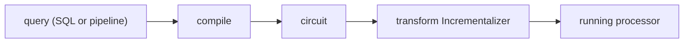
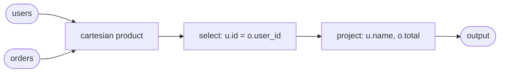

# Programming: Compilers and expressions

## From queries to circuits

Writing circuits by hand is possible but tedious. Compilers automate this: they take a high-level query and produce a circuit wired to the right input and output topics.

The engine ships two compilers. The **SQL compiler** accepts standard SELECT statements and works with the relational data model. The **aggregation compiler** accepts JSON pipelines inspired by MongoDB and works with free-form JSON documents. The [aggregation pipeline language](reference-aggregations.md) and the [expression language](reference-expressions.md) are documented separately in detail. Both compilers produce the same kind of output, so the runtime treats them identically.



The typical lifecycle is: compile a query, and optionally transform the resulting circuit with `Incrementalizer` so it processes deltas instead of full snapshots. In JS this is a one-liner:

```js
sql.table("users", "id INTEGER PRIMARY KEY, name TEXT, age INTEGER");
sql.compile("SELECT name FROM users WHERE age > 25", { output: "out" }).transform("Incrementalizer");
```

## The SQL compiler

The SQL compiler accepts SELECT statements and compiles them into DBSP circuits. It supports single-table queries, multi-table joins, WHERE clauses, column projections, expressions, and NULL handling with proper three-valued logic.

Before compiling a query, register the tables it references. Each table needs a name, column definitions, and optionally a primary key:

```js
sql.table("users", "id INTEGER PRIMARY KEY, name TEXT, age INTEGER");
sql.table("orders", "id INTEGER PRIMARY KEY, user_id INTEGER, total REAL");
```

A basic filter-and-project query:

```js
sql.compile(
    "SELECT name, age FROM users WHERE age > 25",
    { output: "senior-users" }
).transform("Incrementalizer");
```

Feed data by publishing rows to the table's topic:

```js
publish("users", [
    [{ id: 1, name: "alice", age: 30 }, 1],
    [{ id: 2, name: "bob",   age: 22 }, 1],
]);
```

The consumer on `senior-users` receives only alice. When bob turns 26 and you publish the update (delete old bob, insert new bob), the circuit automatically emits the delta: bob now appears in the output.

JOIN clauses compile into a Cartesian product operator followed by the join condition filter and output projection:

```js
sql.compile(
    "SELECT u.name, o.total FROM users u JOIN orders o ON u.id = o.user_id",
    { output: "user-orders" }
).transform("Incrementalizer");
```



After incrementalization, the join tracks what it has seen from each side so that a new row from one input is correctly matched against the accumulated rows from the other.

## The aggregation compiler

The aggregation compiler accepts JSON pipelines where each stage is an object with a single `@`-prefixed key. Stages execute in sequence, each transforming the Z-set produced by the previous stage. The [`@join`](reference-aggregations.md#multi-source-pipelines-join), [`@select`](reference-aggregations.md#filtering-select), [`@project`](reference-aggregations.md#reshaping-project), [`@unwind`](reference-aggregations.md#expanding-lists-unwind), [`@distinct`](reference-aggregations.md#deduplication-distinct), and [`@groupBy`](reference-aggregations.md#grouping-groupby) stages are covered in the aggregation reference. This is the compiler used by the Kubernetes operator's declarative controller spec.

```js
const c = aggregate.compile([
    { "@select": { "@eq": ["$.metadata.namespace", "default"] } },
    { "@project": {
        name: "$.metadata.name",
        containers: { "@len": ["$.spec.containers"] }
    }}
], { inputs: "pods", output: "result" });
c.transform("Incrementalizer");
```

A pipeline can also be a single stage object instead of an array.

## Input and output bindings

Both compilers map pub-sub topic names to circuit inputs and outputs via bindings. A binding has a `name` (the topic on the bus) and a `logical` name (used inside expressions). This lets you reuse the same query with different topic names.

Single input, single output (most common):

```js
aggregate.compile(pipeline, { inputs: "pods", output: "result" });
```

Multiple inputs with explicit logical names, typically used with JOINs:

```js
aggregate.compile(pipeline, {
    inputs: [
        { name: "pods-topic", logical: "pods" },
        { name: "svc-topic", logical: "services" },
    ],
    output: { name: "result-topic", logical: "output" },
});
```

For the SQL compiler, table names serve as the input topic names by default, and the output binding is specified explicitly:

```js
sql.compile("SELECT name FROM users", { output: "my-output-topic" }).transform("Incrementalizer");
```

## Expressions

Expressions are the computational core inside pipeline stages. The [`@select`](reference-aggregations.md#filtering-select) stage evaluates a predicate [expression](reference-expressions.md) on each document. The [`@project`](reference-aggregations.md#reshaping-project) stage evaluates a projection [expression](reference-expressions.md) to produce a new document.

Inside aggregation pipeline stages, expressions follow three rules. A string starting with `$.` is a field reference that reads from the input document. An object with a single `@`-prefixed key is a function call. Anything else is a literal constant. When a pipeline operates on multiple inputs, field references use the logical input name as a prefix to disambiguate which source a field comes from. In SQL, this is the table alias (`u.name`, `o.total`). In aggregation pipelines, the logical name from the input binding is used.


```js
{ "@project": {
    fullName: { "@concat": ["$.firstName", " ", "$.lastName"] },
    isAdult: { "@gte": ["$.age", 18] },
    status: { "@cond": [{ "@gt": ["$.score", 90] }, "excellent", "normal"] },
    tag: "constant-value"
}}
```

Available expressions in this implementation:

- **Field access**: The [field and subject operators](reference-expressions.md#field-and-subject-operators) include `"$.path.to.field"`, which reads a value from the input document using JSONPath.
- **Arithmetic**: The [arithmetic operators](reference-expressions.md#arithmetic-operators) include `@add`, `@sub`, `@mul`, `@div`, and `@mod` for numeric operations.
- **Comparison**: The [comparison operators](reference-expressions.md#comparison-operators) include `@eq`, `@neq`, `@gt`, `@gte`, `@lt`, and `@lte`.
- **Boolean**: The [logical and conditional operators](reference-expressions.md#logical-and-conditional-operators) include `@and`, `@or`, and `@not`.
- **String**: The [string operators](reference-expressions.md#string-operators) include `@concat`, `@lower`, `@upper`, `@string`, and `@regexp`.
- **List**: The [list operators](reference-expressions.md#list-operators) include `@len`, `@in`, `@map`, `@filter`, `@sortBy`, `@sum`, `@min`, and `@max`.
- **Conditional**: The [`@cond`](reference-expressions.md#cond) operator is a ternary if-then-else: `{ "@cond": [test, ifTrue, ifFalse] }`.
- **Null handling**: The [null, SQL boolean, and utility operators](reference-expressions.md#null-sql-boolean-and-utility-operators) include `@isnull`, `@isnil`, and `@nil`.
- **Time**: The [`@now`](reference-expressions.md#now) operator produces a timestamp.

## A Kubernetes controller

Below is a complete example that watches two Kubernetes resources, joins them, and writes the result:

```js
// Define the data sources.
// In unit tests, you can publish directly to these topics instead.
producer.kubernetes.watch({ gvk: "v1/Pod", topic: "pods" });
producer.kubernetes.watch({ gvk: "v1/Service", topic: "services" });

// Compile the pipeline
const c = aggregate.compile([
    { "@join":    { "@eq": ["$.pods.labels.app", "$.services.spec.selector.app"] } },
    { "@project": {
        podName: "$.pods.metadata.name",
        svcName: "$.services.metadata.name"
    }}
], {
    inputs: [
        { name: "pods", logical: "pods" },
        { name: "services", logical: "services" }
    ],
    output: "pod-svc-pairs"
});
c.transform("Incrementalizer");

// React to results
subscribe("pod-svc-pairs", (entries) => {
    for (const [doc, weight] of entries) {
        console.log(weight > 0 ? "+" : "-", doc.podName, "<->", doc.svcName);
    }
});
```

The circuit is now alive: every time a Pod or Service is created, updated, or deleted, the circuit processes only the change and emits the corresponding delta on the output topic.
