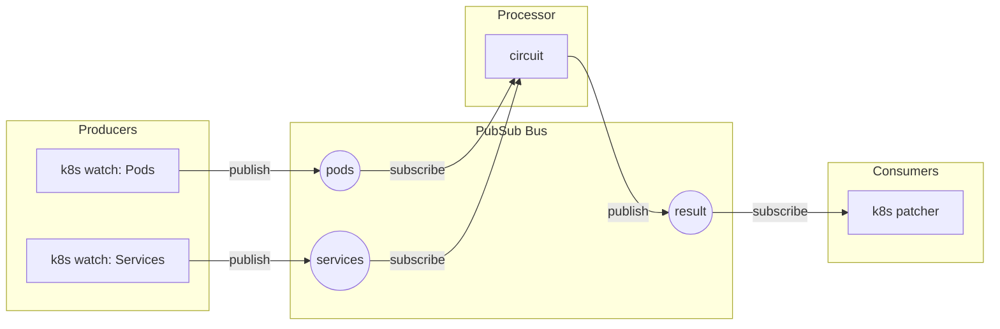
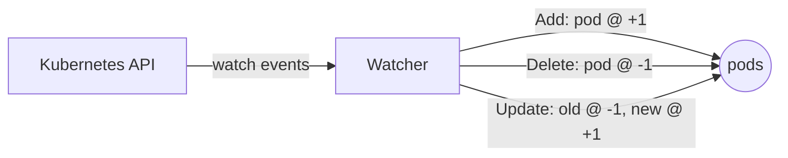
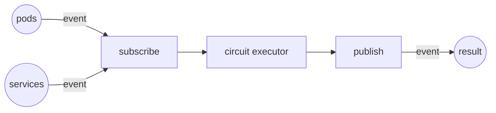

# Runtime: Producers, consumers, processors, and the pub-sub architecture

## Overview

The DBSP engine separates computation (circuits) from I/O (data sources and sinks) using a topic-based pub-sub bus. Producers emit Z-set events onto named topics. Consumers subscribe to topics and react to incoming events. Processors sit in between: they subscribe to input topics, run a compiled circuit on each event, and publish results to output topics.

This architecture decouples where data comes from, how it is processed, and where it goes. A Kubernetes watch, a file reader, and a manual `publish()` call all look the same to the circuit: they produce Z-set events on a topic. Similarly, a Kubernetes patcher, a console logger, and a callback function all look the same on the output side: they consume events from a topic.



## The pub-sub bus

At the core of the runtime is a topic registry. Publishers send events (a topic name plus a Z-set payload) to all subscribers currently listening on that topic. The bus is fully in-process with no external message broker; topics are just strings used as routing keys.

Publish a Z-set to a topic:

```js
publish("my-topic", [[{ id: 1, name: "alice" }, 1]]);
```

Subscribe to a topic and handle events:

```js
subscribe("my-topic", (entries) => {
    console.log("received", entries.length, "entries");
});
```

Any component can publish to any topic, and multiple subscribers can listen to the same topic. Each subscriber has a buffered channel; if it fills up, the publisher blocks until space is available. This preserves ordering and prevents silent data loss.

## Producers

A producer is a component that emits events onto the bus. The simplest producer is a `publish()` call, which sends a one-off Z-set to a topic. For continuous data sources, the runtime provides dedicated producer components.

The Kubernetes connector ships a Watcher producer that uses informers to watch API resources. On each Add/Update/Delete event from the Kubernetes API, the watcher converts the change into Z-set entries: +1 for additions, -1 for deletions, and the pair (-1 old, +1 new) for updates. It maintains a cache to suppress no-op updates where the object content has not actually changed.



Watch Pods in the default namespace and publish to `pods` topic:

```js
producer.kubernetes.watch({
    gvk: "v1/Pod",
    namespace: "default",
    topic: "pods",
});
```

For local unit tests without Kubernetes, publish directly to the topic:

```js
publish("pods", [[{ metadata: { name: "pod-a", namespace: "default" } }, 1]]);
```

You can watch any Kubernetes resource type, filter by namespace or labels, and publish to any topic. Multiple watches can publish to the same topic or to different topics that feed different circuits.

## Consumers

A consumer is a component that reacts to events from a topic. The simplest consumer is `subscribe()`, which registers a callback:

```js
subscribe("result", (entries) => {
    for (const [doc, weight] of entries) {
        console.log(doc.name, "@", weight);
    }
});
```

The Kubernetes connector provides two consumer types. A Patcher consumer takes the output Z-set, computes a merge patch, and applies it to the target resource via the API. An Updater consumer replaces the entire target resource with the output. These are wired automatically when you define an operator in the Kubernetes controller spec.

## Processors

A processor is the component that connects the pub-sub bus to a DBSP circuit. It subscribes to the circuit's input topics, and for each incoming event:

1. Routes the event to the correct circuit input.
2. Feeds the delta through the incremental circuit.
3. Publishes each output Z-set to the corresponding output topic.



You create a processor by compiling a query and optionally incrementalizing it:

```js
sql.table("pods", "name TEXT, status TEXT, ns TEXT");
const c = sql.compile(
    "SELECT name, status FROM pods WHERE ns = 'default'",
    { output: "filtered" }
).incrementalize().validate();
```

After `validate()`, the processor is running. It reacts to events on its input topics and emits deltas on its output topics. Errors during execution are non-critical: they are reported to the runtime error handler and the processor continues processing subsequent events.

### Observers

Processors support execution observers for debugging. An observer callback fires at each node during circuit execution, giving you visibility into what every operator produces:

```js
c.observe((e) => {
    console.log(e.node.id, e.node.kind, e.values);
});
```

You can also observe by circuit name through the runtime, which is useful when you want to attach an observer to a circuit that was created elsewhere:

```js
runtime.observe("my-processor", (e) => {
    console.log(e.node.id, e.position);
});
```

Pass `null` to clear an observer.

### The runtime

The runtime ties everything together. It owns the pub-sub bus and manages the lifecycle of all components (producers, consumers, processors). In the JS scripting runtime, the runtime is created automatically when the VM starts. Producers, consumers, and processors register themselves when you call `producer.kubernetes.watch()`, `subscribe()`, or `c.validate()`. You do not need to manage the runtime lifecycle explicitly.

Non-critical runtime errors (a failed circuit execution, a publish to a full channel) are routed through the runtime's error handler rather than crashing the process:

```js
runtime.onError((e) => {
    console.error(`[${e.origin}] ${e.message}`);
});
```

Components start in the order they are added. The recommended script pattern is to register consumers and processors before first publish, then emit input events.

Components can also be removed or canceled dynamically. This is used by, for instance, the Kubernetes operator controller when operators are added, modified, or deleted at runtime.
