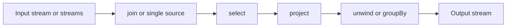

# Reference: Aggregation Pipelines

Aggregation pipelines are the declarative query language used by the DBSP aggregation compiler.
They appear in the JavaScript runtime, in Δ-controller specs, and in test and example programs
across this repository.

An aggregation pipeline is an ordered list of stages. Each stage reads the stream produced by the
previous stage and emits a new stream. In the single-input case, this feels like a document
transformation pipeline. In the multi-input case, the first stage is usually a join that turns
several input streams into one combined stream.

For the Δ-controller view of pipelines, see `apps-dctl-sources-targets-pipeline.md`. This page is
the precise reference for the pipeline language supported by the current compiler.

## Shape of a pipeline

A pipeline can be written in three useful forms.

The shortest form is a single stage:

```yaml
pipeline:
  "@project":
    metadata:
      name: "$.metadata.name"
```

The common form is a list of stages:

```yaml
pipeline:
  - "@select":
      "@eq": ["$.metadata.namespace", "prod"]
  - "@project":
      metadata:
        name: "$.metadata.name"
```

The advanced form is a list of branches. This is mainly used by the aggregation compiler directly,
not by most Δ-controller examples.

```yaml
[
  [
    {"@inputs": ["pods"]},
    {"@project": {"$.metadata.name": "a"}},
    {"@output": "branch1"}
  ],
  [
    {"@inputs": ["branch1"]},
    {"@project": {"$.metadata.namespace": "default"}},
    {"@output": "final"}
  ]
]
```

## Mental model

It helps to think of the pipeline as working on one document at a time.

- `@select` decides whether the document stays in the stream.
- `@project` reshapes it.
- `@unwind` turns one document into many.
- `@distinct` collapses duplicates into set membership.
- `@groupBy` turns many documents into grouped summary documents.
- `@join` combines several source streams into one stream of compound documents.



## Inputs, outputs, and branches

The compiler supports two directive stages that are only needed in explicit multi-branch programs.

### `@inputs`

Selects which named logical streams a branch reads from.

```yaml
{"@inputs": ["pods", "services"]}
```

If you are compiling a single pipeline with one configured input, you normally do not need this at
all. It becomes useful when you explicitly wire several branches together.

### `@output`

Names the logical output stream produced by a branch.

```yaml
{"@output": "service-view"}
```

Again, in the simple single-branch case this is usually implied by the configured compiler output.

## Multi-source pipelines: `@join`

`@join` is the only stage that can combine several input streams into one stream. In the current
compiler, if a branch reads from more than one input, `@join` must be the first non-directive stage.

```yaml
pipeline:
  - "@join":
      "@eq": ["$.dep.metadata.name", "$.pod.spec.parent"]
  - "@project":
      metadata:
        name: result
        namespace: default
      pod: "$.pod"
      dep: "$.dep"
```

The join predicate is evaluated on a compound document whose top-level fields are the logical input
names.

```yaml
pod:
  metadata:
    name: pod-1
  spec:
    parent: dep-1
dep:
  metadata:
    name: dep-1
```

The join stage conceptually takes the Cartesian product of the inputs and keeps only the pairs or
tuples whose predicate evaluates to `true`.

This means:

- with two inputs, `@join` behaves like an inner join,
- with three or more inputs, the predicate usually becomes an `@and` of several equality checks,
- after the join, later stages see one merged document, not several separate streams.

Example with three inputs:

```yaml
"@join":
  "@and":
    - {"@eq": ["$.dep.metadata.name", "$.pod.spec.parent"]}
    - {"@eq": ["$.dep.metadata.name", "$.rs.spec.dep"]}
```

That reads naturally as: join a deployment, pod, and ReplicaSet when they all belong to the same
deployment name.

## Filtering: `@select`

`@select` keeps only the documents whose predicate evaluates to `true`. The surviving documents pass
through unchanged.

```yaml
"@select":
  "@gt": ["$.spec.replicas", 3]
```

This means “let only large deployments through”. If the input object is:

```yaml
metadata:
  name: web
spec:
  replicas: 5
```

then the document survives. If `replicas` is `2`, it is dropped.

Another useful example is filtering after a join:

```yaml
- "@join":
    "@eq": ["$.dep.metadata.name", "$.pod.spec.parent"]
- "@select":
    "@eq": ["$.pod.metadata.namespace", "default"]
```

This first builds deployment or pod pairs, then keeps only the ones whose pod is in the `default`
namespace.

One implementation detail matters here: if a field is missing during `@select`, the compiler treats
that predicate result as `false`, so the document is simply filtered out.

## Reshaping: `@project`

`@project` is the main shape-changing stage. It takes the current document and produces a new one.

There are two modes: object construction and sequential projection.

### Object construction

The most common form is an object whose values are expressions.

```yaml
"@project":
  metadata:
    name: "$.metadata.name"
    namespace: "$.metadata.namespace"
  node: "$.spec.nodeName"
```

If the input is:

```yaml
metadata:
  name: pod-a
  namespace: default
spec:
  nodeName: node-1
  restartPolicy: Always
```

then the output is roughly:

```yaml
metadata:
  name: pod-a
  namespace: default
node: node-1
```

The important rule is that `@project` does not preserve fields automatically. If you do not copy a
field, it is gone from the result.

That is why most useful projections explicitly rebuild `metadata.name` and `metadata.namespace`.

### Sequential projection

The other form is a list of small object fragments applied in order.

```yaml
"@project":
  - {"$.": "$."}
  - {"$.metadata.name": "fixed"}
  - {"$.spec.done": true}
```

This starts from a full copy of the input document, then overrides or adds a few fields.

This is often easier to read than rebuilding a large object from scratch when most of the original
document should stay intact.

Another example is targeted construction without copying the whole source:

```yaml
"@project":
  - {metadata: {name: name2}}
  - {"$.metadata.namespace": default2}
  - {"$.spec.a": "$.spec.b"}
```

This uses successive fragments to build the output object step by step.

## Expanding lists: `@unwind`

`@unwind` takes one document containing a list field and emits one output document per list item.

```yaml
"@unwind": "$.spec.ports"
```

If the input is:

```yaml
metadata:
  name: my-svc
spec:
  ports:
    - {name: http, port: 80}
    - {name: https, port: 443}
```

then the stage emits two documents. In each output document, `spec.ports` is replaced by one single
port object. The compiler also appends an index suffix to `metadata.name`, yielding names such as
`my-svc-0` and `my-svc-1`.

That name rewriting is important. Without it, the unwound outputs would collide as if they were the
same object.

Nested unwind is also allowed:

```yaml
[
  {"@unwind": "$.endpoints"},
  {"@unwind": "$.endpoints.addresses"}
]
```

This first expands the top-level `endpoints` list, then expands the `addresses` list inside each
endpoint.

## Deduplication: `@distinct`

`@distinct` converts a Z-set into set membership.

Its argument must be nullary: either explicit `null` or an empty object `{}`:

```yaml
"@distinct": null
```

```yaml
"@distinct": {}
```

For each document hash, `@distinct` emits weight `1` when the accumulated multiplicity is positive,
and emits nothing otherwise. This is useful after projection when several inputs can map to the same
output object.

```yaml
[
  {"@project": {name: "$.metadata.name", namespace: "$.metadata.namespace"}},
  {"@distinct": null}
]
```

In incremental mode, membership transitions are emitted as deltas:

- `0 -> 1` emits `+1`,
- `1 -> 2` emits `0`,
- `2 -> 1` emits `0`,
- `1 -> 0` emits `-1`.

## Grouping: `@groupBy`

`@groupBy` is the inverse pattern of `@unwind`: many input documents become grouped summary
documents.

Its argument is:

```yaml
"@groupBy": [<keyExpr>, <valueExpr>]
```

or:

```yaml
"@groupBy": [<keyExpr>, <valueExpr>, {distinct: true}]
```

The output shape of `@groupBy` in the current implementation is a document with three fields:

- `key`: the grouping key,
- `values`: the collected values,
- `documents`: the original input documents that contributed to the group.

### Basic example

```yaml
"@groupBy": ["$.metadata.namespace", "$.spec.a"]
```

If the input stream contains:

```yaml
{metadata: {name: a, namespace: default}, spec: {a: 1}}
{metadata: {name: b, namespace: default}, spec: {a: 2}}
```

then the output is one grouped document like:

```yaml
key: default
values: [1, 2]
documents:
  - {metadata: {name: a, namespace: default}, spec: {a: 1}}
  - {metadata: {name: b, namespace: default}, spec: {a: 2}}
```

This is the right mental model: `@groupBy` does not directly build your final application object. It
builds a grouping result that is usually followed by `@project`.

### Distinct mode

With `{distinct: true}`, duplicate values are collapsed.

```yaml
"@groupBy": ["$.metadata.namespace", "$.spec.a", {distinct: true}]
```

If two input rows both contribute value `1`, the output `values` list contains only one `1`.

### Typical follow-up projection

```yaml
[
  {"@groupBy": ["$.metadata.namespace", "$.spec.a"]},
  {"@project": {key: "$.key", items: "$.values"}}
]
```

This is how you turn the generic grouping result into an application-specific output shape.

## Replacing the old `@gather`

Older Δ-controller documentation used `@gather`. The current compiler does not support `@gather`,
`@aggregate`, or `@mux`. Use `@groupBy` followed by `@project` instead.

For example, suppose a previous stage produced one document per endpoint address and you want to
group them back by service port.

```yaml
[
  {"@groupBy": ["$.id", "$.endpoints.addresses"]},
  {"@project": {
      metadata: {name: "$.key.service", namespace: "$.key.namespace"},
      spec: {port: "$.key.port", protocol: "$.key.protocol", addresses: "$.values"}
  }}
]
```

This is exactly the pattern used in the EndpointSlice-style examples in the test suite.

## Single-source examples

### Copy and override

```yaml
pipeline:
  - "@project":
      - {"$.": "$."}
      - {"$.metadata.name": fixed}
```

Intuition: keep the whole input object, but force a stable name.

### Filter and normalize

```yaml
pipeline:
  - "@select":
      "@eq": ["$.metadata.namespace", "prod"]
  - "@project":
      metadata:
        name: "$.metadata.name"
        namespace: "$.metadata.namespace"
      spec:
        replicas: "$.spec.replicas"
        ready: "$.status.readyReplicas"
```

Intuition: keep only production objects and reshape them into a smaller reporting view.

### Expand a list into one object per element

```yaml
pipeline:
  - "@unwind": "$.spec.ports"
  - "@project":
      metadata:
        name: "$.metadata.name"
        namespace: "$.metadata.namespace"
      spec:
        portName: "$.spec.ports.name"
        port: "$.spec.ports.port"
```

Intuition: turn one service with many ports into a stream of per-port records.

## Multi-source examples

### Simple inner join

```yaml
pipeline:
  - "@join":
      "@eq": ["$.dep.metadata.name", "$.pod.spec.parent"]
  - "@project":
      metadata:
        name: result
        namespace: default
      dep: "$.dep"
      pod: "$.pod"
```

Intuition: attach each pod to its parent deployment.

### Join with extra filtering

```yaml
pipeline:
  - "@join":
      "@eq": ["$.dep.metadata.name", "$.pod.spec.parent"]
  - "@select":
      "@eq": ["$.pod.metadata.namespace", "default"]
  - "@project":
      metadata:
        name: result
      pod: "$.pod"
      dep: "$.dep"
```

Intuition: same join as above, but only for default-namespace pods.

### Join using bracketed JSONPath

```yaml
pipeline:
  - "@join":
      "@and":
        - {"@eq": ["$.ServiceView.spec.serviceName", "$[\"EndpointSlice\"][\"metadata\"][\"labels\"][\"kubernetes.io/service-name\"]"]}
        - {"@eq": ["$.ServiceView.metadata.namespace", "$.EndpointSlice.metadata.namespace"]}
```

Intuition: match a view object to an EndpointSlice by service-name label, even though the label key
contains dots and slashes.

## Branching programs

The compiler also supports explicit multi-branch programs. Each branch has its own `@inputs` and
`@output`, and later branches may consume earlier outputs.

```yaml
[
  [
    {"@inputs": ["Pod"]},
    {"@project": {"$.metadata.name": "a"}},
    {"@output": "branch1"}
  ],
  [
    {"@inputs": ["branch1"]},
    {"@project": [{"$.": "$."}, {"$.spec.done": true}]},
    {"@output": "final"}
  ]
]
```

The important rule is that the branch dependency graph must be acyclic. A branch may depend on an
earlier branch output, but cyclic branch wiring is rejected.

## What is not supported

In the current implementation, these stage names are rejected:

- `@gather`
- `@aggregate`
- `@mux`

Use `@groupBy` and `@project` instead.

## Putting it together

A realistic pipeline often mixes several of these ideas. This example expands a service into one
record per port, groups endpoint addresses by port, and reshapes the grouped result into the final
document.

```yaml
[
  {"@unwind": "$.spec.ports"},
  {"@project": {
      metadata: {
        name: "$.metadata.name",
        namespace: "$.metadata.namespace"
      },
      id: {
        service: "$.metadata.name",
        namespace: "$.metadata.namespace",
        port: "$.spec.ports.port",
        protocol: "$.spec.ports.protocol"
      },
      endpoints: "$.spec.endpoints"
  }},
  {"@unwind": "$.endpoints"},
  {"@unwind": "$.endpoints.addresses"},
  {"@groupBy": ["$.id", "$.endpoints.addresses"]},
  {"@project": {
      metadata: {name: "$.key.service", namespace: "$.key.namespace"},
      spec: {port: "$.key.port", protocol: "$.key.protocol", addresses: "$.values"}
  }}
]
```

This is the main style to aim for: each stage does one clear job, and the whole pipeline reads as a
dataflow story rather than as a single monolithic transformation.
